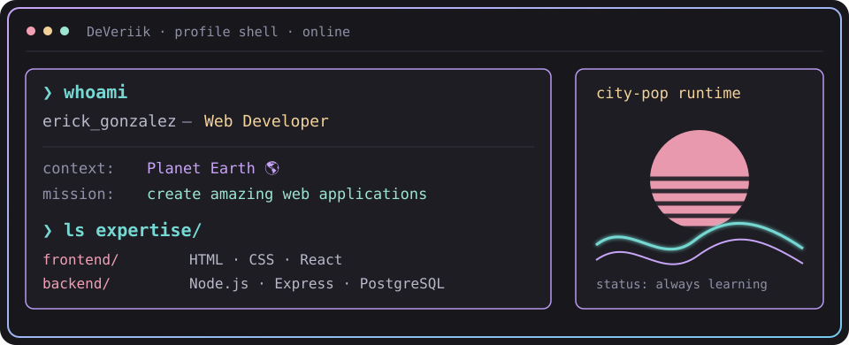

<!-- LOCAL CITY-POP BANNER -->

 

---

## `$ whoami`

  

 

## `$ cat tech-stack.yaml`

<table border="1" cellpadding="14" bgcolor="#17171c">
  <thead>
    <tr>
      <th colspan="2" align="left"><code>DeVeriik:~$ cat tech-stack.yaml</code></th>
    </tr>
  </thead>
  <tbody>
    <tr>
      <td width="50%" valign="top"><code>├─ ✦ frontend_development:</code>  
         
        <code>HTML5 · CSS3 · JavaScript · TypeScript · React · Bootstrap</code>
      </td>
      <td width="50%" valign="top"><code>├─ ⚙ backend_development:</code>  
         
        <code>Node.js · Express · PostgreSQL</code>
      </td>
    </tr>
    <tr>
      <td valign="top"><code>├─ 🛠 tools_version_control:</code>  
         
        <code>Git · GitHub · VS Code · npm · Docker</code>
      </td>
      <td valign="top"><code>├─ 🐧 os_terminal:</code>  
         
        <code>Linux · PowerShell</code>
      </td>
    </tr>
  </tbody>
  <tfoot>
    <tr>
      <td colspan="2"><code>status: learning&nbsp;&nbsp;·&nbsp;&nbsp;environment: development</code></td>
    </tr>
  </tfoot>
</table>

---

<!-- SOCIALS -->
## `$ connect --socials`

&nbsp;&nbsp;

 
 

Built by @DeVeriik · Student & Future Full-Stack Developer 🚀

 
 

Built by @deveriick · Student & Future Full-Stack Developer 🚀

